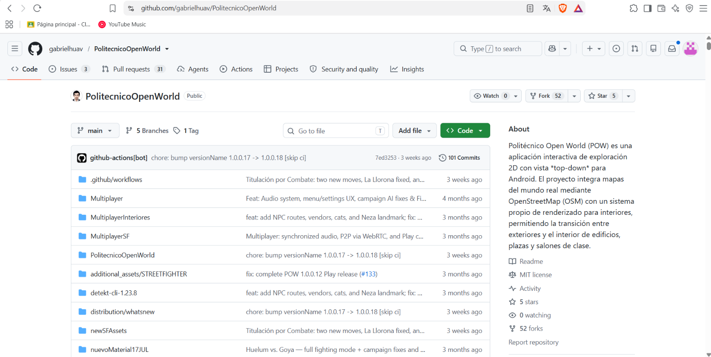
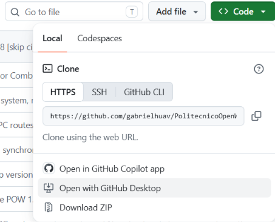
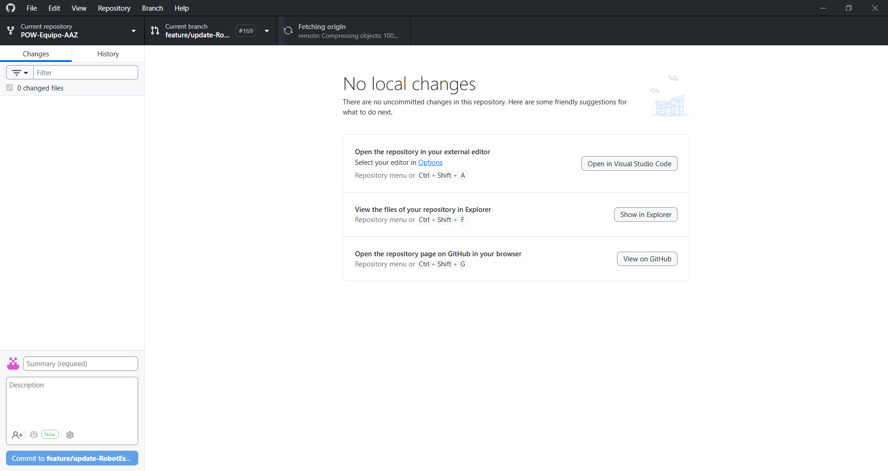
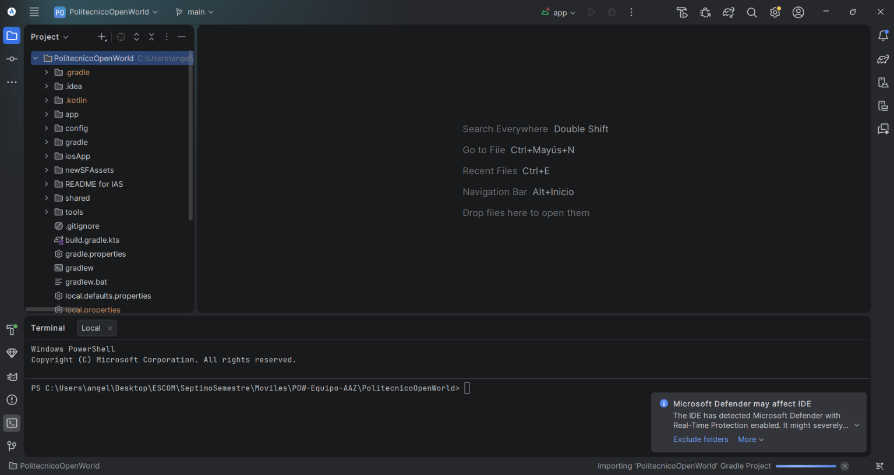
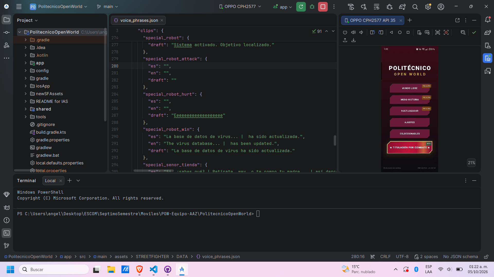
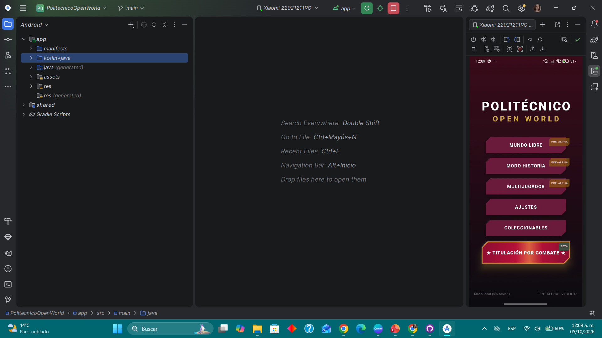

# PolitecnicoOpenWorld - Fork: POW-Equipo-AAZ

**Integrantes:** 
- Orozco Aguilar Angel Isai
- Sanchez Valadez Zyanya Maxi
- Téllez Girón Castro Angel Ricardo

**Grupo:** 7CV4 

---

## Documentación inicial del proyecto
[Seleccione aquí para acceder a la documentación original.](docs/README.md) 

## Pasos para la ejecución de un clon limpio:

1. [Entrar al link seleccionando este texto.](https://github.com/gabrielhuav/PolitecnicoOpenWorld) 

2. Seleccionar el botón verde y seleccionar "Open with GithubDesktop": 

3. Aparecerá una pantalla de carga mientras se clona el repositorio, al terminar debería verse algo pareceido a esto: 

4. Para poder acceder al archivo y modificar el proyecto, abrimos Android Studio en la carpeta PolitecnicoOpenWorld dentro del repositopositorio raíz. 

---

## Idea de aplicación Propia:

El acceso a la documentación de la idea principal de nuestra idea se encuentra a continuación:
[Selecciona aquí para acceder a la documentación](docs/idea.md)

---

## Ligas de los PR del equipo:

- [Selecciona aquí para acceder al Pull Request de Angel Orozco](https://github.com/gabrielhuav/PolitecnicoOpenWorld/pull/169)
- [Selecciona aquí para acceder al Pull Request de Zyanya Sánchez](https://github.com/gabrielhuav/PolitecnicoOpenWorld/pull/171)
- [Selecciona aquí para acceder al Pull Request de Angel Téllez](https://github.com/gabrielhuav/PolitecnicoOpenWorld/pull/173)

## Evidencias de Ejecución:

- Ejecución en el equipo de Angel Orozco: 

- Ejecución en el equipo de Zyanya Sánchez: 

- Ejecución en el equipo de Angel Téllez: 
